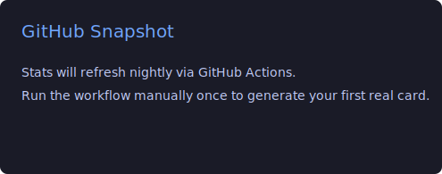

# Robert Marks

I build software, mostly practical things that need to work well over time.

## About
- I like clear systems, small tools, and calm engineering
- I work across product, infrastructure, and AI-assisted workflows
- I prefer steady progress over noisy reinvention

## Right Now
- Improving day-to-day developer workflows
- Exploring where AI helps in practice, not just demos
- Keeping things simple enough to maintain

## Stats

## Connect
- GitHub: https://github.com/robertmarks
- LinkedIn: Add your link
- Website: Add your link

---

If you want to build something useful together, feel free to reach out.
