# Rob Marks

Technical Architect who designs, builds, and operates durable Azure platforms that scale to millions of requests in production.

**Stack:** Azure · Infrastructure as Code · GitHub Actions · Observability · AI-assisted delivery

## About
- Building practical Azure platforms for real production workloads
- Designing systems to be easy to operate, easy to change, and built to last
- Prioritizing long-term maintainability over short-term novelty
- Balancing uptime, cost-awareness, and developer experience in equal measure

## Currently
- Building Azure platforms for clients through pragmatic architecture, automation, and platform guardrails
- Applying repeatable delivery patterns, strong observability, and operational discipline
- Reducing operational complexity through better defaults and automation
- Focused on Azure, platform automation, observability, and AI-assisted delivery

## Stats

<a href="https://github.com/ashutosh00710/github-readme-activity-graph">
  <picture>
    <source media="(prefers-color-scheme: dark)" srcset="https://github-readme-activity-graph.vercel.app/graph?username=robertmarks&area=true&theme=github-dark">
    <source media="(prefers-color-scheme: light)" srcset="https://github-readme-activity-graph.vercel.app/graph?username=robertmarks&area=true&theme=github-light&line=1F6FEB&point=58A6FF&area_color=1F6FEB">
    
  </picture>
</a>

## Working Together

I take on a small number of client engagements, usually one of:

- **Platform & landing-zone builds** — designing and standing up Azure platforms with the architecture, guardrails, and automation to carry real production workloads.
- **Delivery & automation uplift** — repeatable delivery patterns, IaC, and better defaults that cut operational complexity.
- **Observability & operational readiness** — instrumentation and operational discipline that make a platform easy to run, not just easy to ship.
- **Architecture review & advisory** — a pragmatic read on an existing Azure system for maintainability, cost, and reliability.

## Connect
- [LinkedIn](https://www.linkedin.com/in/marksrobert/) - feel free to connect
- [My Site](https://robertmarks.cloud/) - occasional updates

---

If one of those fits, reach out — happy to talk it through.
